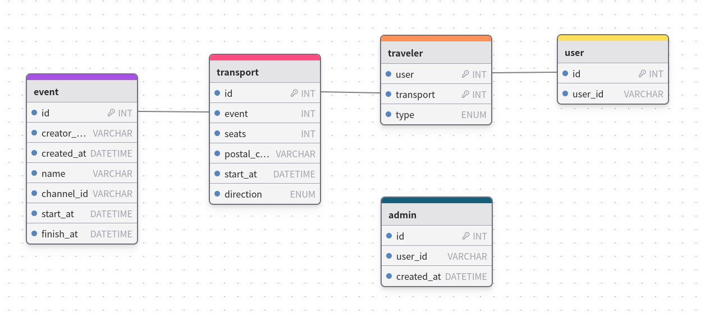

# Hermes

Carpooling Discord bot made for the AFUP events.

## Getting Started

You will require:
- `castor` (see [these instructions](https://github.com/jolicode/castor?tab=readme-ov-file#installation) for how to install)
- a `.env.local` file in `app/` folder with:
    - your Discord bot token (see [related documentation](https://discord.com/developers/docs/quick-start/getting-started#configuring-your-bot) for how to make and recover a bot token)
    - your Discord user id (how to [get your Discord client id](https://www.alphr.com/discord-find-user-id/))

```shell
app/bin/console hermes:register
app/bin/console hermes:event # will create the event you need
app/bin/console hermes:bot
```

And the bot is running for your event ! 🚗

## Available commands

### Admin

Theses commands are only allowed to users that are flagged as admin.

- `/admin_add {user}` Add an user as admin for this bot
- `/admin_remove {user}` Removes an user as admin for this bot

## Contributing

Everyone is free to contribute to this repository.

Please check coding style and phpstan before opening a pull request:
```shell
castor tools:install # will install php-cs-fixer / phpstan
castor tools:cs-fix # will fix coding style
castor tools:cs-check # will check for coding style
castor tools:phpstan # will run static analysis
```

### Database

You'll need to run a local Postgres database.
I recommend using Docker for this: `docker run -e POSTGRES_USER=afup -e POSTGRES_PASSWORD=p4ssw0rd --network host postgres:16.2`



Was done thanks to https://drawdb.vercel.app/editor, imported schema can be
found in `assets/database_overview.ddb`.
